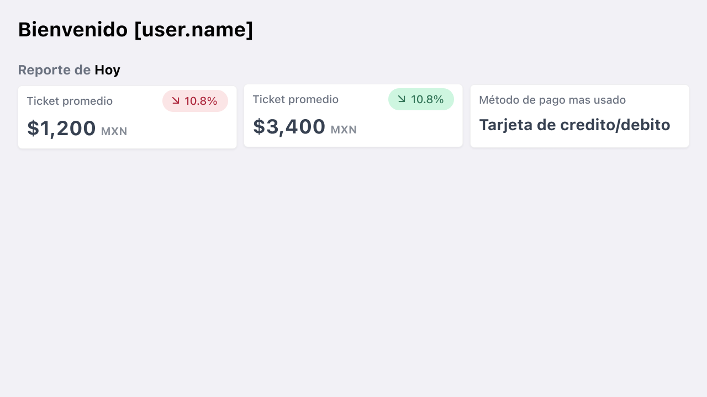

# Challenge PayCode
Para este challenge de front-end deberas de re-crear el diseño proporcionado y llenar los datos usando los endpoints proporcionados.

## Endpoint
Obtener Reporte: `GET - /challenge/unauth/report`
  ```JSON
  {
    "averageTicket": 1200,
    "topTicket": 3400,
    "topPaymentMethod": "card",
    "revenuePerHour": [
        0,
        0,
        0,
        0,
        0,
        0,
        0,
        0,
        0,
        6400,
        12800,
        15000,
        5400,
        12300,
        10800,
        6400,
        3200,
        4500,
        8500,
        3900,
        1200,
        400,
        0,
        0
    ],
    "previousDay": {
        "averageTicket": 1400,
        "topTicket": 2400,
        "topPaymentMethod": "card",
        "revenuePerHour": [
            0,
            0,
            0,
            0,
            0,
            0,
            0,
            0,
            0,
            3000,
            18800,
            12000,
            5100,
            16200,
            9800,
            2400,
            6200,
            2500,
            5500,
            9900,
            1200,
            400,
            0,
            0
        ]
    }
}
  ```

## Diseño
